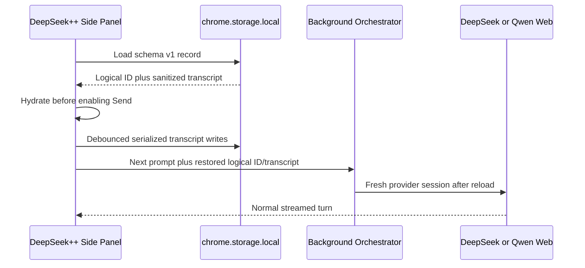

# Provider conversation persistence verification

**Status:** complete; automated and live Chrome reload acceptance passed
**Date:** 2026-07-12
**Branch:** `codex/provider-conversation-persistence`
**Base:** local `main` at `15675d5`
**Chrome unpacked path:** `/Users/kyin/Projects/deepseek-pp/dist/chrome-mv3`

This ledger verifies the durable active-conversation slice that follows the completed Qwen provider work. Provider transport, authentication, ENI/LIME, Skills, tools, and bounded cross-provider transfer remain unchanged.

## Delivered behavior

| Requirement | Result | Evidence |
|---|---|---|
| Restore active logical transcript | Automated pass | `tests/sidepanel-interactions.test.ts` hydrates user, assistant, reasoning, provider/model, and attachment metadata |
| Reuse logical conversation ID | Automated pass | Restored ID is sent in the next `CHAT_SUBMIT_PROMPT` |
| Persist stream updates | Automated pass | User, assistant, reasoning, provider, and model survive the 200 ms write debounce |
| Confirmed New Session reset | Automated pass | Old transcript is cleared and a fresh empty logical ID replaces the durable record |
| Sanitized attachments | Automated pass | Name/type persist; blob URL, data URL, and provider upload data are removed |
| Bounded storage | Automated pass | Newest 200 messages and 1,000,000 combined text/reasoning characters |
| Live close/reload restoration | Live pass | `PERSIST-7319` transcript restored after extension reload, Qwen recalled the canary, and confirmed New Session remained empty after another reload |

## Storage contract

Fail-closed load rule: a **missing** key opens a fresh conversation; a **present** invalid/future/corrupt record must reject visibly without overwrite. Valid schema v1 restores normally.

Fork-local keys related to this slice (also registered in persistence compatibility docs):

| Key | Role |
|---|---|
| `deepseek_pp_active_chat_conversation` | Active logical transcript (schema v1) |
| `activeChatModelRef` | Selected provider/model ref for sidepanel chat |
| `qwenCachedAuth` | Cached Qwen browser auth material (sensitive) |

The workspace owns one active transcript record in `chrome.storage.local`:

```text
key: deepseek_pp_active_chat_conversation
schemaVersion: 1
```

Persisted fields:

- logical conversation ID;
- message role and visible text;
- assistant reasoning text;
- message provider ID and model ID;
- image attachment name and MIME type;
- record creation and update timestamps.

Explicitly excluded:

- Qwen/DeepSeek cookies, authorization headers, tokens, JWTs, Baxia values, or captured authentication;
- provider-native chat IDs, response IDs, parent cursors, or session state;
- Qwen/DeepSeek provider upload objects and temporary STS/OSS values;
- image bytes, data URLs, and runtime blob preview URLs;
- composer drafts, upload progress, streaming flags, and transient errors.

The record retains the newest 200 normalized messages. Combined persisted `text` plus `reasoningText` is capped at 1,000,000 characters; the oldest boundary message is truncated only when required to fill the remaining budget.

## Lifecycle mechanism



Provider-native cursors are intentionally not restored. After an extension reload, the background has no valid in-memory provider session, so the existing bounded transfer path starts a fresh upstream session using the restored visible transcript.

Confirmed New Session generates a new logical ID and immediately writes an empty replacement record. Store writes are serialized in the side-panel context, preventing an older debounced write from overtaking that replacement.

## TDD evidence

### Store RED

Command:

```bash
npx vitest run tests/provider-conversation-store.test.ts
```

Observed failure:

```text
Failed to resolve import "../core/chat/conversation-store"
Test Files 1 failed (1)
```

The failure occurred because the production store did not exist.

### Store GREEN

The same command passed after the minimal store implementation:

```text
Test Files 1 passed (1)
Tests 5 passed (5)
```

### Side-panel RED

Command:

```bash
npx vitest run tests/sidepanel-interactions.test.ts
```

Before UI integration, the three new lifecycle tests failed because:

- the seeded transcript did not render;
- no durable record was written after streaming;
- the seeded transcript was not available for New Session replacement.

### Side-panel GREEN

Focused verification after integration:

```bash
npx vitest run tests/provider-conversation-store.test.ts tests/sidepanel-interactions.test.ts tests/provider-conversation-transfer.test.ts
npm run compile
```

Results:

```text
Test Files 3 passed (3)
Tests 23 passed (23)
TypeScript: passed with zero errors
```

## Complete automated verification

Commands:

```bash
npm run compile
npx vitest run \
  tests/provider-conversation-store.test.ts \
  tests/sidepanel-interactions.test.ts \
  tests/provider-conversation-transfer.test.ts \
  tests/provider-*.test.ts \
  tests/qwen-*.test.ts \
  tests/cursor-bridge-tool-loop.test.ts \
  tests/cursor-bridge-worker.test.ts
npm test
npm run build:chrome
```

Results:

- compile: passed with zero TypeScript errors;
- focused provider/Qwen/persistence/tool-loop selection: 13 files, 70 tests passed;
- full suite: 88 files, 523 tests passed;
- Chrome MV3 build: passed, 72.53 MB output at `dist/chrome-mv3`.

The WXT build emitted the existing Pyodide browser-externalization warnings for Node built-ins and completed successfully.

## Live Chrome acceptance evidence

The user exercised the built extension from the only approved unpacked path, `/Users/kyin/Projects/deepseek-pp/dist/chrome-mv3`, and supplied the resulting screenshots in sequence.

| Step | Observation | Result |
|---|---|---|
| Seed conversation | Qwen received the conversation-only canary `PERSIST-7319` | Passed |
| Reload extension | The original user message and partial Qwen reasoning reappeared in the side panel | Passed |
| Use restored context | The user asked for the exact persistence code; Qwen answered `PERSIST-7319` | Passed |
| Confirm reset | The `+` control displayed the New Session destructive confirmation | Passed |
| Reload after reset | The side panel reopened with the empty-state screen and no old transcript | Passed |

Screenshot evidence supplied during acceptance:

- `codex-clipboard-5b730327-6c7a-4139-b56b-c4d24d7f7fb0.png` — seeded canary, persisted partial reasoning, and the first-turn Qwen response-ID error;
- `codex-clipboard-9b251c15-60c0-40db-9ba6-8347a6f5e6cb.png` — the same transcript restored after extension reload;
- `codex-clipboard-8129e6d8-1681-4a54-8c66-b9421f115d0e.png` — Qwen answered `PERSIST-7319` from the restored transcript;
- `codex-clipboard-e3eb0579-07dd-482d-bafa-53ed28563c9f.png` — New Session confirmation;
- `codex-clipboard-2e5fd528-a370-4fdb-9895-909d2093f2f5.png` — empty state after the reset and another extension reload.

The first seeded Qwen turn streamed reasoning but ended with `Qwen stream did not return a response id.` This does not invalidate the persistence result: the partial visible transcript was durably restored, the following Qwen turn consumed that restored transcript and returned the exact canary, and the reset independently survived reload. The missing response ID is a separate Qwen transport defect and is not claimed fixed by this slice.

## Remaining boundaries

- One active logical conversation only; no conversation-history browser.
- No sanitized transcript export yet.
- No **Share continuity across providers** toggle yet.
- Attachment name/type survive reload; local thumbnail bytes do not.
- No provider-native session/cursor resumption after extension reload.
- No push or deployment.
- No Muse or qwenRelay change or dependency.
