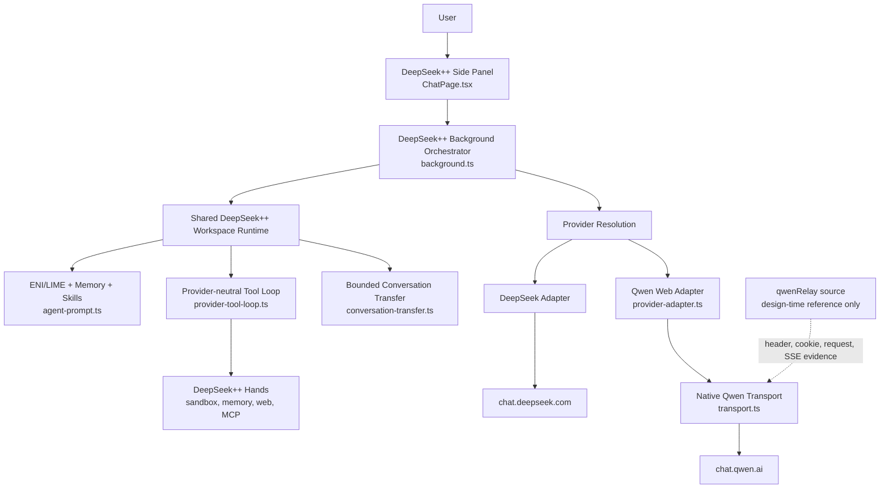
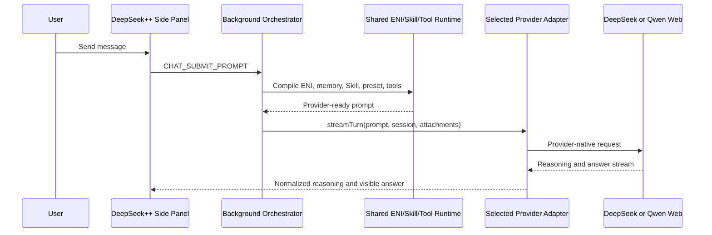

# DeepSeek++ Qwen provider architecture

**Status:** implemented and live-verified
**Date:** 2026-07-12
**Repo:** `/Users/kyin/Projects/deepseek-pp`
**Branch:** `feature/qwen-provider`
**Chrome unpacked path:** `/Users/kyin/Projects/deepseek-pp/dist/chrome-mv3`

This document describes the shipped internal structure and mechanisms. The approved scope is in [QWEN-PROVIDER-PLAN.md](./QWEN-PROVIDER-PLAN.md); acceptance evidence is in [QWEN-PROVIDER-VERIFICATION.md](./QWEN-PROVIDER-VERIFICATION.md).

## Product boundary

DeepSeek++ is one workspace with two model providers:

- **The DeepSeek++ workspace owns:** ENI/LIME identity, Bond/Life context, memories, Skills, presets, local tools, tool receipts, image presentation, and the visible logical conversation.
- **A provider module owns:** authentication, provider-native sessions, request formatting, streaming parsing, upload transport, model metadata, and provider errors.
- **The provider does not own a second ENI, memory database, Skill registry, or tool runtime.**

The extension connects directly to the selected provider. Qwen traffic goes from the DeepSeek++ extension to `https://chat.qwen.ai`; there is no qwenRelay hop.

## Runtime structure



There is deliberately no runtime arrow from DeepSeek++ to qwenRelay.

## Component ownership

| Component | File | Responsibility |
|---|---|---|
| Provider contract | `core/chat/provider.ts` | Internal provider/model/session/turn types; opaque string `parentCursor` |
| Model catalog | `core/chat/provider-registry.ts` | DeepSeek and `qwen3.7-plus` metadata, image capability, upload limits |
| Active model store | `core/chat/provider-model-store.ts` | Persist selected `ChatModelRef` in `chrome.storage.local` |
| Shared prompt compiler | `core/chat/agent-prompt.ts` | ENI/LIME, Bond, memories, presets, `/skill`, locale, and tool descriptors |
| Conversation transfer | `core/chat/conversation-transfer.ts` | Fresh provider session plus newest bounded visible transcript |
| Shared tool loop | `core/chat/provider-tool-loop.ts` | Parse tool request, execute local tool, build receipt, continue on opaque cursor |
| Qwen tool encoding | `core/chat/tool-protocol.ts` | Buffered JSON envelope and one bounded format repair |
| Qwen auth | `core/qwen/auth.ts` | Capture, normalize, merge, cache, and reload Qwen web authentication metadata |
| Qwen adapter | `core/qwen/provider-adapter.ts` | Convert shared session/turn contract to Qwen session/transport types |
| Qwen transport | `core/qwen/transport.ts` | Create chat, send turns, parse reasoning/answer SSE, retain UUID cursor |
| Qwen image upload | `core/qwen/upload.ts` | STS initialization, signed OSS upload, confirmation, completion file object |
| Background orchestration | `entrypoints/background.ts` | Provider resolution, shared runtime composition, Chrome auth/cookie access, events |
| Side-panel UI | `entrypoints/sidepanel/pages/ChatPage.tsx` | Provider selector, logical transcript, composer, uploads, stream rendering |
| Message UI | `entrypoints/sidepanel/components/ChatMessage.tsx` | Provider-associated message content and sent-image thumbnails |

## Provider-neutral contract

The shared seam is intentionally internal and minimal:

```ts
type ProviderId = 'deepseek-web' | 'qwen-web';

interface ProviderSession {
  conversationId: string;
  parentCursor: string | null;
}

interface ChatProviderAdapter {
  readonly providerId: ProviderId;
  getStatus(): Promise<ProviderStatus>;
  listModels(): ProviderModel[];
  createSession(model: ChatModelRef): Promise<ProviderSession>;
  streamTurn(input: ProviderTurnInput, events: ProviderEvents): Promise<ProviderTurn>;
}
```

`parentCursor` is opaque in shared code:

- DeepSeek converts its numeric message ID at the DeepSeek adapter boundary.
- Qwen retains the upstream UUID `parent_id` / response ID without conversion.
- Tool continuation receives the cursor from the completed provider turn and returns it to the same provider adapter.

## Turn mechanism



The side panel sends:

- selected `ChatModelRef`;
- stable logical conversation ID;
- normalized visible transcript;
- text and provider attachment objects;
- DeepSeek-specific controls only when DeepSeek is selected.

The background resolves the provider, compiles the shared workspace prompt once, runs the shared tool loop, and emits normalized stream events back to the panel.

## Qwen authentication mechanism

qwenRelay was inspected to identify the web values Qwen requires. DeepSeek++ then implemented its own capture and cache:

| Value | DeepSeek++ source | Use |
|---|---|---|
| `Authorization` | Qwen request header, `token` cookie, or Qwen page storage | Bearer authentication |
| `Version` | Qwen request header/page storage; verified fallback exists | Qwen web-client version header |
| `bx-umidtoken` | Qwen request header/page storage | Baxia request metadata |
| `bx-ua` | Qwen request header/page storage | Baxia client metadata |
| Qwen cookies, including `ssxmod_*` | Chrome cookie jar through `credentials: include` | Browser session and Baxia cookies |

Capture paths:

1. `chrome.webRequest.onBeforeSendHeaders` observes successful Qwen web requests after the user logs in.
2. A Qwen tab, when available, can refresh token/version/Baxia values from page storage.
3. Chrome cookies are read directly from the Qwen cookie jar.
4. Normalized values are stored under `qwenCachedAuth` in `chrome.storage.local`.
5. Later turns load cached values and the real Chrome cookie jar, so an open Qwen tab is not required.

No raw authentication values are logged or committed.

## Native Qwen transport mechanism

The extension performs Qwen web operations directly:

1. `POST https://chat.qwen.ai/api/v2/chats/new` creates a provider-native chat.
2. `POST https://chat.qwen.ai/api/v2/chat/completions?chat_id=...` sends the streamed turn.
3. The request body contains `qwen3.7-plus`, `chat_id`, UUID `parent_id`, generated user/response IDs, feature configuration, and uploaded file objects.
4. The parser accepts observed Qwen response cursor variants:
   - nested `response.created.response_id` or `response.created.id`;
   - event-shaped `response.created` with nested response;
   - top-level `response_id`;
   - top-level `id` on choice events.
5. `thinking_summary` is normalized as reasoning; `answer` content is normalized as visible text.
6. Reading stops and the stream is cancelled when the finished answer phase arrives.
7. `401/403`, `429`, upstream HTTP errors, malformed JSON, and missing cursors become explicit provider errors.

## Shared ENI, memory, and Skill mechanism

`compileSharedAgentPrompt` is provider-neutral. It resolves:

- ENI/LIME system identity;
- ENI memory facts and Bond context;
- enabled DeepSeek++ memories;
- the active preset and cadence;
- `/skill-name` commands from the shared Skill registry;
- the shared local tool catalog.

The Qwen adapter does not contain copies of these systems. Qwen receives the same compiled identity and workspace context through its user-message payload.

For Qwen's JSON tool mode, executable XML instructions are excluded from the base prompt. Identity, memory, Skill, and task content remain present.

## Tool execution and continuation

DeepSeek's existing XML transport remains unchanged. Qwen uses a provider-specific JSON response envelope because Qwen Web can interpret XML-looking tool requests itself.

```mermaid
sequenceDiagram
    participant Qwen
    participant Loop as DeepSeek++ Tool Loop
    participant Tool as Local sandbox/tool

    Qwen-->>Loop: kind=tool_calls with sandbox_run
    Loop->>Tool: Execute locally
    Tool-->>Loop: Result receipt
    Loop->>Qwen: TOOL_RESULTS on Qwen response cursor
    Qwen-->>Loop: kind=final with natural answer
```

Mechanism:

1. Qwen returns exactly one buffered JSON object: `kind: final` or `kind: tool_calls`.
2. DeepSeek++ validates requested names against the real shared tool descriptors.
3. The existing local runtime executes the call; the Qwen adapter never executes tools.
4. Bounded result detail/output is serialized into a continuation prompt.
5. Continuation uses the upstream Qwen response UUID as the next `parent_id`.
6. Raw JSON and tool protocol text remain hidden from the visible transcript.
7. One format-repair turn is allowed; there is no blind retry loop.

## Provider switching and bounded context

The side panel retains one logical visible conversation. A provider/model change does not clear that transcript.

On the next send after a switch:

1. `shouldStartFreshProviderSession` rejects the stale provider-native session.
2. The selected adapter creates a fresh upstream session.
3. `buildBoundedConversationTransfer` selects the newest non-empty messages, capped at 12 messages and 12,000 characters by default.
4. The transcript is prepended inside `<conversation_transfer>` with the current user request separated explicitly.
5. The new provider continues the same visible conversation while its own native cursor chain starts fresh.

Switching back repeats the same process. A provider session is never resumed after it missed turns handled by another provider.

## Image mechanism

Qwen image uploads use the real Qwen web flow:

1. The side panel validates the selected provider's limit (DeepSeek 8 MB; Qwen 20 MB).
2. `UPLOAD_CHAT_IMAGE` sends the image bytes to the background.
3. Qwen returns temporary STS/OSS data from `getstsToken`.
4. DeepSeek++ signs and performs the OSS `PUT`, then calls Qwen's confirmation endpoint.
5. The resulting Qwen completion file object is attached to the next Qwen message.
6. After send, the composer clears immediately and a compact thumbnail remains in the sent user message.
7. Blob preview URLs are revoked when the conversation is cleared or the panel unmounts.

The provider upload object is transport-owned; thumbnail presentation is workspace/UI-owned.

## qwenRelay reference boundary

qwenRelay had one role: **design-time protocol evidence**.

It was useful for identifying:

- the Qwen authentication/header values listed above;
- Baxia cookie behavior;
- chat creation and completion request fields;
- UUID parent/response cursor behavior;
- SSE response variants;
- Qwen STS/OSS image upload structure.

It is not:

- imported by DeepSeek++;
- listed in `package.json` or `package-lock.json`;
- spawned as a process;
- called through HTTP;
- a package, API, service, or deployment prerequisite.

The correct acceptance check is an architecture, import, package, process-spawn, and request-URL review. A localhost port monitor is not required and is not meaningful once there is no call path in the shipped code.

## Current lifecycle limitation

The visible side-panel transcript currently lives in React state. Closing or reloading the panel destroys that rendered transcript. This does **not** remove cached Qwen authentication, the selected provider, or provider-side chats, but it means DeepSeek++ cannot export or recover the closed panel's combined cross-provider view today.

Durable logical-conversation persistence and a sanitized transcript export are future workspace features, documented in [roadmap/provider-workspace-continuity.md](./roadmap/provider-workspace-continuity.md).

## Operational invariants

- One repo only: `/Users/kyin/Projects/deepseek-pp`.
- One unpacked Chrome path only: `/Users/kyin/Projects/deepseek-pp/dist/chrome-mv3`.
- No worktree or second project directory.
- No Muse or port `8788` changes.
- No public provider SDK.
- No qwenRelay runtime dependency.
- No rewrite of the working DeepSeek transport.
- Rollback remains provider-local: remove/disable the Qwen catalog entry and adapter without removing the shared runtime.
