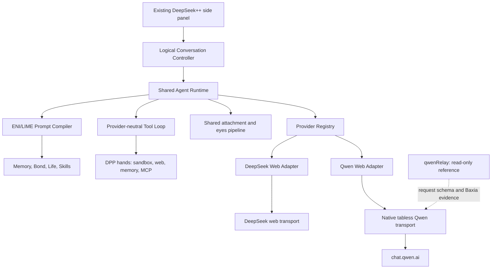
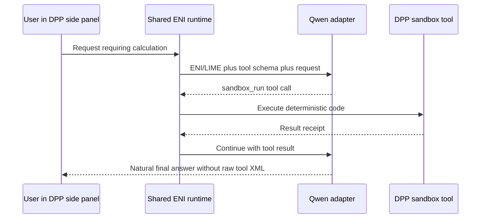

# Approved plan: Qwen provider and multi-provider DeepSeek++

**Status:** Implemented and verified
**Date:** 2026-07-12
**Repo:** `/Users/kyin/Projects/deepseek-pp` only
**Execution branch:** `feature/qwen-provider` after the current dirty tree is preserved
**Chrome load path:** `/Users/kyin/Projects/deepseek-pp/dist/chrome-mv3`

**Implementation architecture:** [QWEN-PROVIDER-ARCHITECTURE.md](./QWEN-PROVIDER-ARCHITECTURE.md)
**Verification closeout:** [QWEN-PROVIDER-VERIFICATION.md](./QWEN-PROVIDER-VERIFICATION.md)

## Goal

Turn DeepSeek++ into one modular agent workspace where the existing side panel can switch between DeepSeek and Qwen while preserving ENI/LIME, memory, Skills, hands, eyes, and tool execution.

This is a medium-sized architecture change, not a rewrite. Expected effort is roughly **7–12 focused engineering days**. The only unusually difficult slice is making Qwen's tabless transport native to DeepSeek++.

### Locked decisions

- Same side panel; no separate Qwen chat UI.
- One provider/model dropdown.
- Switching providers carries bounded conversation context.
- Qwen starts with the proven `qwen3.7-plus`.
- `qwenRelay` is read-only protocol evidence for the Qwen authentication values, request fields, Baxia/cookie behavior, cursor shapes, SSE, and uploads. DeepSeek++ implements those mechanisms natively and calls `chat.qwen.ai` directly; qwenRelay is not a runtime dependency, codebase dependency, service hop, or new product direction.
- Muse remains paused and untouched.
- Internal adapters only; no public provider SDK.
- One canonical repo and Chrome build path; no worktree.

### Evidence already established

- Qwen request injection is proven end-to-end: a randomized canary added to the outgoing user content appeared in Qwen's thinking summary and final answer.
- `/Users/kyin/Projects/qwenRelay` proves tabless Qwen authentication, Baxia handling, SSE, and multi-turn transport are solvable on this machine. It is reference material only.
- DeepSeek++ already has reusable prompt augmentation, ENI state, Skills, runtime tools, and continuation loops.
- The main shared-code coupling is the assumption that every provider uses DeepSeek's numeric `parentMessageId`.
- At plan approval, the dirty tree failed `npm run compile`; the targeted ENI/tool-loop/worker suites passed 32/32 tests. Qwen work must start from an isolated clean baseline.

## Architecture



Introduce only the internal contract needed now:

```ts
type ProviderId = 'deepseek-web' | 'qwen-web';

interface ChatModelRef {
  providerId: ProviderId;
  modelId: string;
}

interface ProviderSession {
  conversationId: string;
  parentCursor: string | null;
}

interface ChatProviderAdapter {
  getStatus(): Promise<ProviderStatus>;
  listModels(): ProviderModel[];
  createSession(model: ChatModelRef): Promise<ProviderSession>;
  streamTurn(input: ProviderTurnInput, events: ProviderEvents): Promise<ProviderTurn>;
  uploadAttachments?(files: File[]): Promise<ProviderAttachment[]>;
}
```

Architecture rules:

- `parentCursor` is opaque. DeepSeek converts it to and from its numeric message ID; Qwen keeps its UUID `parent_id`.
- The shared runtime owns ENI/LIME compilation, Skills, memory selection, tool parsing/execution, receipts, and final-response cleanup.
- Providers own authentication, session creation, request shape, streaming parsing, attachments, and upstream errors.
- One visible DeepSeek++ conversation remains authoritative.
- Changing providers creates a fresh provider-native session seeded with a bounded normalized transcript. Never resume a stale provider session after it missed cross-provider turns.
- Each assistant message records its provider and model for badges and diagnostics.

## Implementation phases

### P0 - Preserve current work and establish a clean branch

- In the canonical repo, create local branch `wip/pre-qwen-20260712` and checkpoint the current dirty tree without modifying it. Do not push it.
- Return to committed `main` and create `feature/qwen-provider`.
- Do not cherry-pick Muse files or the current mixed WIP into the Qwen branch.
- Keep Chrome loaded only from `/Users/kyin/Projects/deepseek-pp/dist/chrome-mv3`.
- Establish a green baseline with `npm run compile`, targeted tests, and `npm run build:chrome`. Fix only baseline blockers required for those checks.

### P1 - Native tabless Qwen transport

- Capture the Qwen web JWT after login and retain it like DeepSeek's cached login.
- Read the real Chrome Qwen cookie jar and Baxia session artifacts.
- Implement chat creation, query/body `chat_id`, string `parent_id`, `qwen3.7-plus`, request IDs, feature configuration, and SSE parsing.
- Parse `response.created`, `thinking_summary`, answer deltas, completion, authentication failures, and daily rate-limit responses.
- Verify with every Qwen tab closed and no request to `127.0.0.1:9881`.

Use real Chrome background transport first. If Qwen rejects extension-origin requests after reproducing the proven cookie/Baxia request shape, add a minimal provider-specific transport host inside DeepSeek++ using only the required Baxia/TLS pieces. Do not silently depend on qwenRelay or require an open Qwen tab.

### P2 - Shared agent runtime

- Remove the numeric DeepSeek parent-ID assumption from the continuation engine.
- Extract only the ENI/LIME prompt, memory, Skill, tool, receipt, and continuation behavior needed by both providers.
- Wrap existing DeepSeek behavior behind the new adapter without rewriting its working transport.
- Keep provider-specific prompts out of the shared core; Qwen receives the same compiled ENI/tool instructions through its user-message payload.

### P3 - Same-side-panel provider switching

- Replace the hard-coded `official-api | deepseek-web` UI state with a provider/model catalog.
- Add `GET_CHAT_CATALOG` and a persisted active `ChatModelRef`.
- Extend `CHAT_SUBMIT_PROMPT` with the selected provider/model and logical conversation ID.
- Add provider/model badges to messages.
- On provider change, retain the visible transcript, create a new upstream session, and inject bounded transfer context automatically.
- Preserve current DeepSeek controls and show only capabilities relevant to the selected provider.

### P4 - Real parity vertical slice

The first accepted Qwen slice must complete this entire path:



Then prove:

- Existing ENI memory and relationship state are present.
- A bundled `/skill` modifies the Qwen turn.
- `sandbox_run` executes and Qwen uses its result.
- An image is processed through the Qwen attachment/eyes path.
- DeepSeek to Qwen switching carries a randomized fact from the visible conversation.
- Switching back to DeepSeek still works.
- Qwen rate limits appear as an honest UI state; no blind retry loop.

### P5 - Hardening and long-term maintenance

- Provider-specific failures must never break DeepSeek.
- Add provider readiness and last-error diagnostics without logging tokens or full prompts.
- Keep Qwen request fixtures isolated so upstream schema drift affects one adapter.
- Put technical architecture in internal docs only; keep the public README feature-focused.
- A future provider should require an adapter, auth capture, models, and transport tests, not changes to ENI, tools, or the chat UI.

## Verification and acceptance

Required automated checks:

```bash
npm run compile
npx vitest run tests/provider-*.test.ts tests/qwen-*.test.ts \
  tests/cursor-bridge-tool-loop.test.ts tests/cursor-bridge-worker.test.ts
npm run build:chrome
```

Required live checks:

1. Log into Qwen once, close all Qwen tabs, then complete a side-panel Qwen turn.
2. Complete one deterministic `sandbox_run` roundtrip with no raw tool markup exposed.
3. Exercise one Skill, one ENI memory/context case, and one image case.
4. Switch DeepSeek to Qwen to DeepSeek while preserving the logical conversation.
5. Confirm by architecture, request-URL, import, package, and process-spawn inspection that no qwenRelay dependency or call path exists. Do not substitute localhost port monitoring for this dependency review.
6. Reload the extension and repeat Qwen chat using cached authentication.
7. Confirm current DeepSeek side-panel, Cursor/Hermes bridge, and DeepSeek web interception remain functional.

Rollback is provider-local: disable or remove the Qwen catalog entry and adapter while leaving the shared DeepSeek path operational. Revert Qwen commits independently; never restore through another worktree or Chrome build directory.

## Boundaries and stop conditions

- qwenRelay may be inspected for request fields and Baxia behavior but is never edited or called by the shipped integration.
- The shipped Qwen adapter connects directly to `https://chat.qwen.ai`; qwenRelay is not an intermediary.
- Muse files, port `8788`, and Muse entrypoints are out of scope.
- The first Qwen model is `qwen3.7-plus`; dynamic model discovery comes after the vertical slice.
- No public adapter SDK, provider marketplace, broad rename, or unrelated refactor.
- If native tabless Qwen requires an external runtime beyond a narrow in-repo provider host, stop and report the exact failed request boundary before expanding scope.

## Paste-ready Codex execution brief

```text
You are implementing the approved Qwen provider vertical slice in
/Users/kyin/Projects/deepseek-pp.

Read first:
- docs/QWEN-PROVIDER-PLAN.md
- docs/HANDOFF-NEXT-AGENT.md
- docs/decisions/2026-07-10-single-repo-no-worktree.md
- docs/decisions/2026-07-10-eni-and-hermes.md

Objective:
Make the existing DeepSeek++ side panel switch between DeepSeek and
qwen3.7-plus while preserving ENI/LIME, memory, Skills, hands, eyes, and the
tool continuation loop. Qwen must work after login with all Qwen tabs closed.

Starting state:
- The current main working tree contains unrelated uncommitted ENI and paused
  Muse work and does not typecheck.
- The repo has an accepted single-repo/no-worktree decision.
- Qwen request injection and tabless Qwen transport feasibility are already
  proven.
- /Users/kyin/Projects/qwenRelay is reference material only.

Execution:
1. Preserve the exact dirty state on local branch wip/pre-qwen-20260712.
2. Create feature/qwen-provider from committed main in the same repo.
3. Establish a green compile, targeted-test, and Chrome-build baseline.
4. Implement a native tabless Qwen transport and prove one streamed turn before
   modifying the UI.
5. Add the minimal provider-neutral session/turn contract with opaque string
   cursors.
6. Reuse the existing ENI/Skill/memory/tool runtime; do not duplicate it inside
   the Qwen adapter.
7. Add the provider/model selector and bounded cross-provider context transfer.
8. Complete the Qwen sandbox_run roundtrip, Skill, memory, image, and
   DeepSeek-to-Qwen-to-DeepSeek acceptance checks.

Constraints:
- Do not create a worktree.
- Do not touch core/muse-spark, Muse host files, port 8788, or Muse entrypoints.
- Do not make qwenRelay a runtime, package, API, or process dependency.
- Do not add a public provider SDK.
- Do not rewrite working DeepSeek transport or adjacent UI.
- Do not push or deploy.
- Stop before introducing any external runtime other than a narrowly scoped
  in-repo Qwen transport host.
- Every changed line must support the Qwen provider or the minimal shared seam.

Done when:
npm run compile, the targeted provider/Qwen/bridge tests, and
npm run build:chrome pass; live Chrome proves tabless Qwen, ENI context,
sandbox tool execution with continuation, image handling, and context-preserving
provider switching without regressing DeepSeek.

Final response:
1. Changed
2. Verified
3. Notes
List exact commands and live evidence. Do not claim tabless success without
closing every Qwen tab during the test.
```
