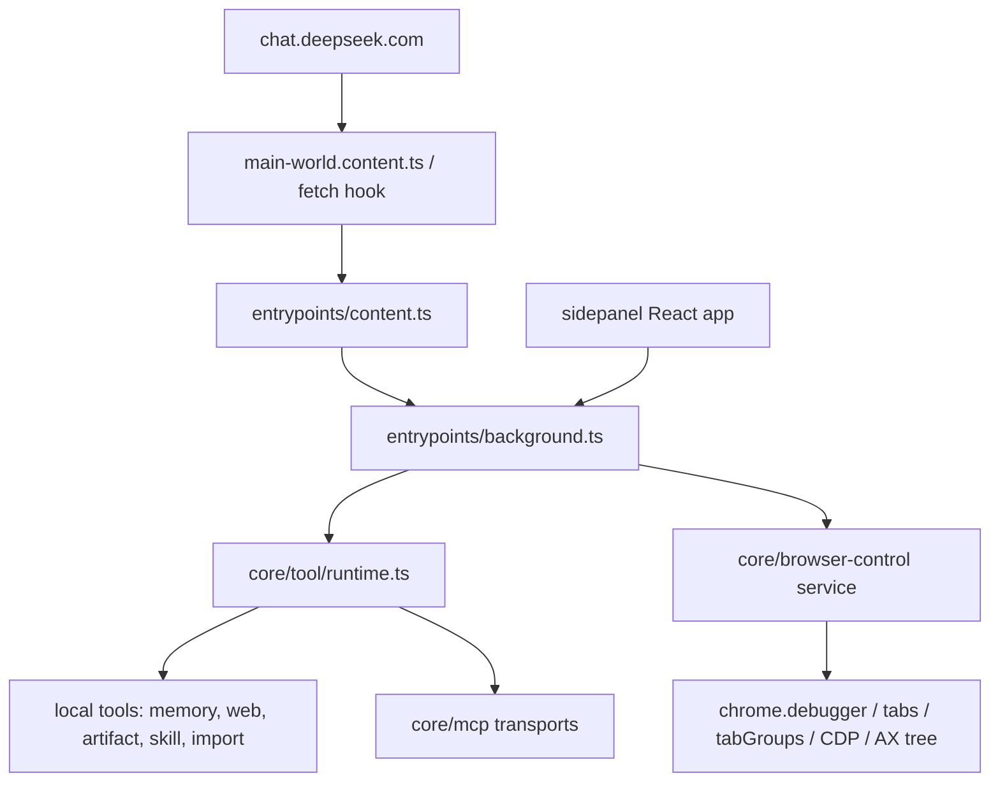

# Project Overview

## Implemented Direction

DeepSeek++ now has Gemini-Nexus parity browser-control infrastructure implemented locally: a Chromium-owned CDP runtime with `chrome.debugger`, Accessibility Tree UID snapshots, controlled tab and tab group scope, browser action tools, sidepanel controls, permission governance, and automated validation. The remaining release gate is live Chrome sidepanel/browser-control smoke in the user's real Chrome profile.

## Current Architecture

DeepSeek++ is a WXT / Manifest V3 extension with four primary runtime surfaces:

The current codebase has a mature tool-call and continuation loop plus a background-owned browser-control runtime. Browser-control code lives under `core/browser-control/*`, uses Chromium debugger/tabs APIs, exposes `browser_*` descriptors through the local tool runtime, and is wired into manual chat, sidepanel chat, inline agent, and automation paths.

The ownership boundary is background-owned browser control. `entrypoints/background.ts` owns runtime messages, permission requests, tool execution, sidepanel chat loops, automation, alarms, and offscreen sandbox; it calls `core/browser-control/*` rather than implementing CDP state inside `entrypoints/content.ts` or the DeepSeek fetch hook.

## Technology Stack

| Layer | Current | Target |
|:--|:--|:--|
| Language | TypeScript | TypeScript |
| Extension Framework | WXT MV3 | WXT MV3, Chromium browser-control capability gated |
| UI | React 19 + Tailwind | React sidepanel Browser Control surface |
| Tool Protocol | DeepSeek++ direct XML tool tags via `ToolDescriptor` | Same protocol, with browser-control descriptors implemented |
| Browser Automation | `chrome.debugger` + CDP + `chrome.tabs` + optional `chrome.tabGroups` | Live Chrome smoke pending |
| Page Observation | Existing DeepSeek page text/context plus CDP Accessibility Tree snapshots | Live Chrome smoke pending |
| Storage | `chrome.storage.local`, Dexie-backed feature stores, browser-control settings/state/history | unchanged |
| Package Manager | npm workspaces | unchanged |

## Entry Points

| Entry | Current Responsibility | Browser-Control Relevance |
|:--|:--|:--|
| `wxt.config.ts` | Manifest construction, permissions, CSP, browser targets, asset plugins | Declares Chromium browser-control permissions and unsupported paths |
| `entrypoints/background.ts` | Background RPC, tool runtime execution, sidepanel chat loop, automation, permissions, broadcasts | Owns browser-control service lifecycle, browser-control messages, and screenshot/Vision routing |
| `entrypoints/content.ts` | DeepSeek page coordination, tool cards, inline agent UI, content-side artifact fast path | Does not own CDP state; renders status/tool cards and requests background execution |
| `entrypoints/main-world.content.ts` | MAIN world fetch hook bridge | No direct browser-control implementation; receives descriptors through existing hook state |
| `core/tool/runtime.ts` | Tool descriptor aggregation and execution dispatch | Includes browser-control local provider and execution path |
| `core/tool-loop/engine.ts` | Sequential tool execution and continuation helper | Reused for browser actions with result-size and stop-reason contracts |
| `core/inline-agent/loop.ts` | Manual-chat inline agent continuation | Allows browser-control tools while preserving snapshot observation discipline |
| `entrypoints/sidepanel/*` | React UI for chat, tools, MCP, settings, automation, projects | Includes Browser Control management page under Capabilities |

## Build & Run

Important commands from `package.json`:

| Command | Purpose |
|:--|:--|
| `npm run dev` | WXT development server |
| `npm run build:chrome` | Chrome MV3 build |
| `npm run build:edge` | Edge MV3 build |
| `npm run build:firefox` | Firefox MV3 build |
| `npm run build:all` | Chrome + Edge + Firefox builds |
| `npm run compile` | TypeScript check |
| `npm test` | Vitest suite |
| `npm run verify:manifest-policy` | Manifest permission and packaging policy check |
| `npm run prompt:freeze` | Prompt contract freeze |
| `npm run ci:quality` | Current strongest full quality gate |

Browser-control work must update `scripts/manifest-policy-check.mjs` whenever manifest permissions or public permission documentation change.

## Testing Baseline

Existing tests cover:

- tool parser, streaming tool parser, tool card rendering, tool restore storage
- MCP discovery/transport smoke and mock verification
- platform capabilities
- inline agent prompts and renderer behavior
- sidepanel navigation and product surfaces
- manifest policy and release asset checks through npm scripts
- browser-control settings, descriptors, CDP connection, tab target state, snapshot leases, actions, screenshot/Vision routing, result budgets, and unsupported-platform behavior
- sidepanel/browser-control chat lifecycle, stream ids, terminal timeout handling, and compact tool disclosure source contracts

Remaining browser-control verification:

- real Chrome smoke against the user's profile after `npm run smoke:chrome-preflight` returns `GO`
- final visual audit of sidepanel disclosure state after the live smoke
- service-worker lifetime and Chrome Task Manager evidence if memory/lag remains suspicious

## Project Governance Baseline

| Surface | Status |
|:--|:--|
| Shared instructions | `AGENTS.md`, auto-generated from Claude project memory; do not hand-edit durable rules unless the sync source is also updated |
| Claude-specific instructions | no root `CLAUDE.md`; `.claude/settings.local.json` may exist |
| Other platform rule surfaces | `.codex/` exists, no project skill files found |
| Native memory | Codex native memory is available and preferred for durable facts |
| Repo fallback memory | none declared; do not create one without explicit user selection |
| Active old spec files | `docs/analysis`, `docs/plan`, and `docs/progress` held a completed Better DeepSeek spec; archived copy exists under `docs/archives/better-deepseek-capability-adoption/` |

## External Integrations

- DeepSeek Web, via request/response hook on `chat.deepseek.com`.
- DeepSeek official API / sidepanel chat loop.
- MCP tools through HTTP, SSE, streamable HTTP, stdio bridge, and native messaging.
- Chrome extension APIs: existing `storage`, `alarms`, `nativeMessaging`, `contextMenus`, `offscreen`, `sidePanel`; browser-control parity adds Chromium-specific `debugger`, `tabs`, and `tabGroups`.
- Android WebView bridge, currently non-extension and explicitly lacks native browser extension APIs.

## Browser-Control Invariants

Browser control is a platform capability plus local tool provider, not an extension of MCP or a content-script patch. The key invariants are:

- one background-owned debugger session manager
- one controlled tab and tab group registry
- one Accessibility Tree UID snapshot contract
- one runtime provider shared by manual chat, sidepanel chat, inline agent, and automation
- explicit unsupported behavior for Firefox and Android
