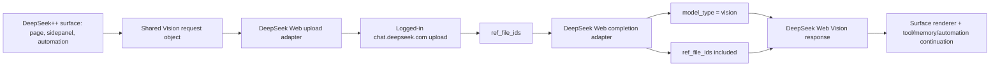

# DeepSeek Web Vision Routing Plan

Date: 2026-06-20

## Confirmed Intent

Build DeepSeek++ Vision as a logged-in `chat.deepseek.com` web-session capability, not as DeepSeek official API usage and not as OpenAI/Gemini/native-host multimodal analysis.

The final product should let DeepSeek++ surfaces send image-backed turns to DeepSeek Web Vision by uploading media through the logged-in web session, passing returned `ref_file_ids`, and submitting with explicit `model_type: "vision"`.

## Product Scope

- **In scope**: shared DeepSeek Web Vision upload/routing core.
- **In scope**: in-page DeepSeek chat image attachment through DeepSeek++.
- **In scope**: sidepanel chat image attachment and Vision routing.
- **In scope**: automation image inputs and Vision routing.
- **In scope**: prompt augmentation, memories, skills, presets, and tool loops around Vision turns.
- **In scope**: paired Instant-vs-Vision evaluation before final behavior decisions.
- **Out of scope**: removing or refactoring current OpenAI/Gemini multimodal API settings.
- **Out of scope**: fixing or depending on the current `com.deepseek_pp.multimodal` native host.
- **Out of scope**: DeepSeek official API key mode for Vision.
- **Out of scope for first pass**: videos and generic document upload unless discovery proves they use the same safe contract.

## Current-State Facts To Preserve

- DeepSeek Web completion requests already accept `model_type` and `ref_file_ids` in the repo's web adapter.
- Sidepanel web chat currently sends text-only turns with `modelType: null` and `refFileIds: []`.
- Current 1.0.x multimodal flow is a preflight analyzer: OpenAI/Gemini/native-host analyzes media, then DeepSeek receives text analysis. That is not the desired Vision product path.
- Instant mode also exposes upload, but the UI indicates Instant extracts text; upload availability alone does not prove pixel-level image reasoning.
- Existing OpenAI/Gemini multimodal settings and MCP code should remain as-is and unused by this new path.

## Final Architecture

## Core Design

Add a shared DeepSeek Web Vision core that owns:

- accepted image types and size limits;
- in-memory pending media state;
- upload request construction;
- logged-in web auth/client headers;
- returned `ref_file_ids` normalization;
- explicit `model_type: "vision"` routing when image refs are present;
- file metadata safe for history and automation logs;
- cleanup after send, failure, route change, or run completion.

Do not store raw image bytes durably unless a later task explicitly requires it. Store only metadata such as name, MIME type, size, upload status, and returned file IDs.

## Surface Wiring

### In-Page Chat

- Use a DeepSeek++ attach control or integrated hook around the existing page input.
- Upload image through the shared DeepSeek Web Vision core.
- Submit the real user turn with `model_type: "vision"` and `ref_file_ids`.
- Preserve memory, skills, project context, prompt settings, and tool descriptors.
- Do not route image content through OpenAI/Gemini preflight analysis.

### Sidepanel Chat

- Add sidepanel image attachment UI.
- Use the same shared upload core.
- Send web-chat turns with `modelType: "vision"` and `refFileIds`.
- Keep DeepSeek official API key mode out of this feature.
- Continue tool loops in the same chat session and parent-message chain.

### Automation

- Automation inputs can include image attachments or image references.
- Automation runner uses the shared upload core before starting a Vision turn.
- Stored automation prompt options must record explicit `modelType: "vision"` when image refs are used.
- Automation history should record safe file metadata and returned file IDs, not raw image bytes.
- Tool-result continuation turns should preserve the existing session/parent chain and should not re-upload images unless a new automation step explicitly includes new media.

## Evaluation Plan

Run paired Instant-vs-Vision tests before finalizing behavior. Each case uses the same image and same prompt in fresh chats:

- Instant mode run.
- Vision mode run.
- Capture `model_type`, `ref_file_ids`, upload request facts, answer, latency, and failure mode.
- Score 0-3:
  - `0`: wrong or ignores image.
  - `1`: mostly text extraction or generic response.
  - `2`: mostly correct with minor misses.
  - `3`: grounded, specific, actionable, and honest about uncertainty.

### Personalized Eval Set

| # | Case | Prompt | Reason |
|:--|:--|:--|:--|
| 1 | DeepSeek++ settings screenshot | Tell me exactly what is misconfigured, optional, and irrelevant for DeepSeek Web Vision. | Catches API-key confusion. |
| 2 | MCP error screenshot | What is the actual error, what command is suggested, and is this relevant to DeepSeek Web Vision? | Tests UI debugging. |
| 3 | Instant vs Vision tooltip screenshots | Compare these modes. What capability difference matters for image understanding? | Tests the key Instant/Vision distinction. |
| 4 | Chrome extension page screenshot | Which extension is loaded, what version/state is visible, and what manual action is next? | Tests install/reload workflow. |
| 5 | Terminal compile error screenshot | Identify the first real error, likely cause, and smallest fix. | Tests repo debugging. |
| 6 | Code screenshot | Find the risky line and give one minimal fix. | Tests visual code review. |
| 7 | Git diff screenshot | What changed, what is risky, and what test verifies it? | Tests review workflow. |
| 8 | Dense config screenshot | Extract exact active config values and defaults. | Tests source-of-truth extraction. |
| 9 | Architecture diagram screenshot | Describe the flow, missing edge cases, and likely integration point. | Tests design reasoning. |
| 10 | UI layout bug screenshot | What overlaps, what is unreadable, and what layout rule likely caused it? | Tests frontend QA. |
| 11 | Chart/dashboard screenshot | Identify trend, anomaly, and one misleading interpretation to avoid. | Tests non-text visual reasoning. |
| 12 | Log/crash screenshot | Separate root cause, secondary warnings, and unknowns. | Tests diagnostics. |
| 13 | Small-text screenshot | Read the small label and state confidence. | Tests OCR boundary. |
| 14 | No-text photo | Describe objects and spatial relationships; ignore filename/metadata. | Separates real vision from text extraction. |
| 15 | Misleading filename image | What is actually shown? | Detects metadata hallucination. |
| 16 | Before/after UI screenshots | Which is before, which is after, and what changed? | Tests regression review. |
| 17 | Sidepanel image task | From this screenshot, what should DeepSeek++ sidepanel do next? | Validates sidepanel product value. |
| 18 | Automation image task | Create an automation action from this screenshot: monitor, trigger, expected result. | Keeps automation in scope. |
| 19 | Repo plus screenshot | Using this screenshot and repo context, identify the likely file to inspect first. | Tests Vision plus project context. |
| 20 | Blurry/partial screenshot | What can you verify, what is uncertain, and what would confirm it? | Tests calibrated uncertainty. |

Decision threshold:

- Vision beats Instant by at least `+0.75` average on visual/UI/debug cases.
- Vision clearly wins on cases 10, 11, 14, 16, 17, and 18.
- Instant only matches Vision on text-heavy screenshots or docs.
- Vision requests are proven to use `model_type: "vision"` and real `ref_file_ids`.
- Sidepanel and automation can call the same Vision path without storing raw image bytes.

## Implementation Phases

### Phase 0: Discovery And Contract Freeze

Goal: verify DeepSeek Web upload and completion contracts before coding behavior.

Tasks:

- Capture native Instant upload request/response.
- Capture native Vision upload request/response.
- Capture native Vision completion body with uploaded image.
- Identify required headers, cookies, PoW behavior, session coupling, and response shapes.
- Determine whether upload must run in background, content script, or main-world context.
- Document drift risks and stable fields.

Verification:

- Save sanitized request/response fixtures.
- Confirm Instant and Vision differ in model/request behavior, not just UI labels.
- Confirm whether `ref_file_ids` are enough for Vision completion.

### Phase 1: Shared DeepSeek Web Vision Core

Goal: create one reusable adapter for all surfaces.

Tasks:

- Add typed media input, upload result, and Vision turn contracts.
- Add upload adapter with injectable fetch for tests.
- Add model routing helper that forces `vision` only when image refs are present.
- Add safe metadata normalization.
- Add cleanup/error semantics.

Verification:

- Unit tests for upload request construction, response parsing, error handling, and cleanup.
- Adapter tests proving completion body includes `model_type: "vision"` and `ref_file_ids`.

### Phase 2: In-Page Chat Wiring

Goal: make the live DeepSeek page use true DeepSeek Web Vision through DeepSeek++.

Tasks:

- Replace or bypass current preflight multimodal analyzer for the new DeepSeek Web Vision path.
- Keep existing OpenAI/Gemini multimodal code untouched.
- Wire pending image attachments into request augmentation.
- Preserve memory/skills/project/tool augmentation.
- Ensure route changes clear pending media.

Verification:

- Unit tests for request augmentation with pending image refs.
- Manual Chrome test with a no-text image and a visual prompt.
- Confirm request has `model_type: "vision"` and `ref_file_ids`.

### Phase 3: Sidepanel Chat Wiring

Goal: make sidepanel chat a first-class Vision surface.

Tasks:

- Add sidepanel image attachment UI.
- Upload through shared Vision core.
- Submit sidepanel web-chat turns with `modelType: "vision"` and `refFileIds`.
- Preserve sidepanel tool loop behavior and parent-message chain.
- Surface clear errors for missing login, upload failure, and expired session.

Verification:

- Component/state tests for sidepanel attachment UI.
- Background tests for sidepanel Vision input.
- Manual sidepanel image prompt test.

### Phase 4: Automation Wiring

Goal: support image-backed automation runs through the same Vision path.

Tasks:

- Extend automation input model to include image attachments or image refs.
- Upload images before starting the automation turn.
- Store explicit `modelType: "vision"` in prompt options.
- Record safe file metadata and returned file IDs in automation history.
- Ensure tool-result continuations do not re-upload unless the step supplies new media.

Verification:

- Automation runner tests for image refs, model routing, history metadata, and continuation behavior.
- Manual automation smoke with a screenshot-triggered task.

### Phase 5: Evaluation And Product Cleanup

Goal: prove quality and remove user-facing confusion without touching legacy code unnecessarily.

Tasks:

- Run the personalized Instant-vs-Vision eval set.
- Record scoring and request evidence.
- Update labels/copy only where needed to distinguish DeepSeek Web Vision from legacy OpenAI/Gemini multimodal.
- Keep README/store docs capability-level and avoid exposing internal endpoints.

Verification:

- Eval result document with scores.
- `npm run compile`
- `npm test`
- `npm run build:all`
- `npm run verify:manifest-policy`
- Manual Chrome extension reload and real Vision image prompt.

## Rollback Plan

- Keep existing text chat behavior unchanged.
- Keep existing OpenAI/Gemini multimodal path untouched.
- Gate new Vision path behind isolated wiring points until verified.
- If upload discovery fails, remove only the new adapter/UI wiring.
- If sidepanel or automation wiring fails, keep shared adapter and in-page path disabled until tests pass.

## Approval Checklist Before Implementation

- Scope confirmed: in-page chat, sidepanel chat, and automation are all in scope.
- Legacy OpenAI/Gemini multimodal remains untouched.
- First implementation is images only unless discovery proves broader media support is safe.
- Discovery fixtures are captured before implementation.
- Rollback path is understood.
- Verification includes automated tests, build, manifest policy, and manual Chrome Vision smoke.
