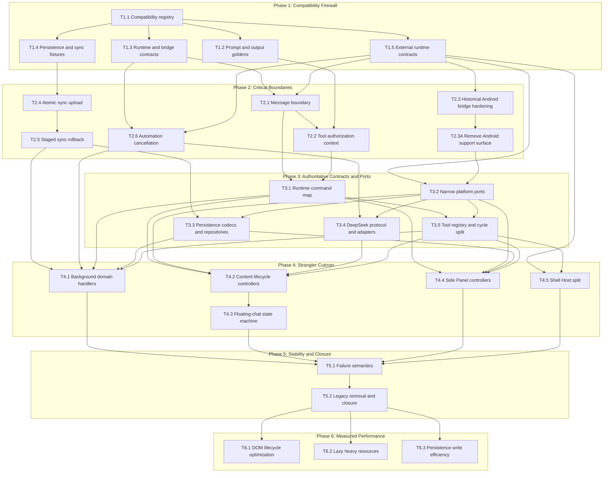

# DeepSeek++ Reliability and Compatibility Refactor — Dependency Graph

## Critical Path

The critical path is the compatibility registry → runtime contract → message/tool safety → typed command map → tool registry → background/content cutover → compatibility closure → measured optimization. Sync and automation are independent P0 vertical slices that must converge before the background cutover.

## Integration Order

| Phase | Parallel Work | Required Serial Merge |
|:--|:--|:--|
| 1 | T1.2, T1.3, T1.4, and T1.5 after T1.1 | Merge contract indexes once after all fixture lanes finish. |
| 2 | Runtime/tool, platform-scope, sync, and automation lanes | T2.1 → T2.2; T2.3 → T2.3A; T2.4 → T2.5; merge runtime/tool before rebasing automation wiring. |
| 3 | Command/tool, platform/persistence, and DeepSeek lanes | T3.1 → T3.5; T3.2 → T3.3; central contract integration last. |
| 4 | Background, content, Side Panel, and Shell Host lanes | Only one owner edits each central entrypoint; T4.2 → T4.3. |
| 5 | None | T5.1 → T5.2; this is the single compatibility-integration lane. |
| 6 | DOM, resource loading, and persistence lanes | Re-run all performance baselines after merging the three lanes. |

## Forbidden Dependency Shapes

- Contract or schema modules importing browser, DOM, provider, or entrypoint implementations.
- A new router running beside the existing background switch after a command has migrated.
- A persistence migration writing both legacy and current stores as peer truth sources.
- A broad platform/service abstraction with no production consumer in the same task.
- More than one concurrent executor editing `entrypoints/background.ts` or `entrypoints/content.ts`.
