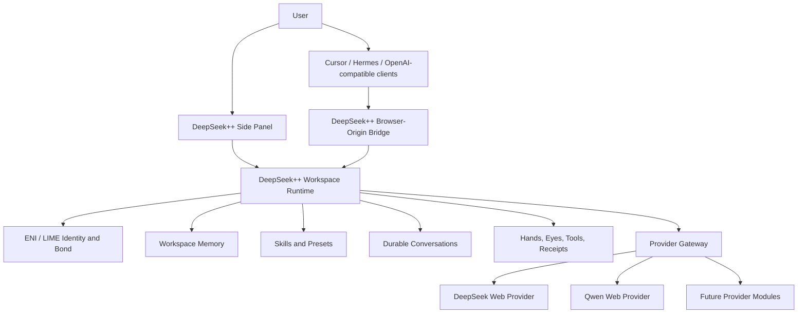

# DeepSeek++ final vision and outcome roadmap

**Status:** authoritative product direction
**Date:** 2026-07-12
**Canonical repo:** `/Users/kyin/Projects/deepseek-pp`
**Chrome unpacked path:** `/Users/kyin/Projects/deepseek-pp/dist/chrome-mv3`

## Final vision

DeepSeek++ is a **local personal agent workspace with interchangeable model brains**.

The user opens one workspace and talks to the same ENI/LIME identity, memories, Skills, hands, eyes, and conversation history. DeepSeek, Qwen, and future providers supply reasoning and generation; they do not become separate products, personalities, memory silos, or tool runtimes.

The finished product should feel like this:

- one side panel, one workspace, and one durable conversation system;
- select the best model for a turn without rebuilding context or losing identity;
- choose explicitly whether conversation continuity is shared across providers or isolated per provider;
- log into a web provider once, close its tabs, and continue using it from DeepSeek++;
- use the same Skills, memories, local tools, receipts, and image workflow regardless of the selected provider;
- close or reload Chrome without losing active work, then browse and resume earlier DeepSeek++ conversations;
- expose genuinely provider-native capabilities without duplicating capabilities already owned by DeepSeek++;
- use the same workspace identity from the side panel and, where deliberately enabled, from Cursor/Hermes through the existing browser-origin bridge;
- fail clearly: every turn ends in a final answer, a useful error, or an intentional cancellation—never an unexplained permanent Thinking state.

This is not a Qwen integration project. Qwen is the first proof that the DeepSeek++ workspace can outlive and outgrow any one model provider.

## North-star architecture

The workspace is the product. Provider modules are replaceable execution engines.

## Product contract

These rules remain true across every outcome horizon:

1. **Workspace-owned identity:** ENI/LIME, Bond/Life, memories, Skills, presets, tools, receipts, and visible conversations belong to DeepSeek++.
2. **Provider-owned transport:** authentication, model metadata, native sessions/cursors, request encoding, streaming parsing, upload transport, limits, and upstream errors belong to the provider adapter.
3. **No duplicate runtime:** a provider adapter never receives its own copy of memory, Skills, tools, receipts, or continuation logic.
4. **Explicit continuity:** shared continuity is a workspace policy the user controls, not an accidental side effect of provider switching.
5. **Local-first operation:** cached browser authentication and the Chrome cookie jar support tabless turns without exporting credentials to another service.
6. **One canonical build:** one repo, no second worktree/project directory, and one Chrome load path.
7. **Reference is not dependency:** qwenRelay remains design-time protocol evidence only; DeepSeek++ never imports, spawns, calls, packages, or deploys it.
8. **Provider-local failure:** a broken optional provider must not break DeepSeek, the workspace database, or local tools.
9. **No hidden protocol:** raw tool XML/JSON, authentication values, upload credentials, and provider-native cursor details never appear in the user transcript.
10. **Evidence before claims:** automated tests prove contracts; live Chrome runs prove authentication, streaming, tools, eyes, reload behavior, and provider switching.

## Foundation already delivered

- DeepSeek and `qwen3.7-plus` are selectable in the existing side panel.
- Qwen uses a native direct `chat.qwen.ai` transport with cached authentication and no qwenRelay runtime path.
- The shared prompt compiler supplies ENI/LIME, memory, Bond context, presets, and bundled Skills to either provider.
- The shared local tool loop executes tools and returns receipts to the selected provider.
- Images use provider-owned upload transport and workspace-owned presentation.
- Bounded DeepSeek → Qwen → DeepSeek conversation transfer is live-verified.
- One sanitized active logical conversation survives extension reloads.
- Confirmed New Session durably clears that conversation.
- The browser-origin bridge already exposes DeepSeek++ models to Cursor/Hermes without creating a second extension.

## Outcome horizons

The horizons are ordered by dependency and user value. Implementation details and TDD slices are planned internally; the user-facing unit of progress is a completed outcome with evidence.

### Horizon A — Trustworthy provider turns

**Outcome:** DeepSeek and Qwen behave like reliable interchangeable brains, including after reload and without provider tabs open.

The current `Qwen stream did not return a response id.` case belongs here. The solution is not a one-off UI patch: Qwen stream fixtures, cursor extraction, terminal-state handling, cancellation, partial-stream recovery, and honest error mapping must converge into one transport contract.

**Acceptance gate:**

- every observed stream reaches exactly one final, error, or cancelled terminal state;
- no successful answer is discarded solely because its response cursor appeared in a newly observed event shape;
- cached-auth text, multi-turn, Skill, sandbox continuation, and image turns pass with every Qwen tab closed;
- extension reload and DeepSeek → Qwen → DeepSeek switching pass without stuck Thinking state or raw protocol leakage;
- provider/Qwen/tool-loop tests, full tests, compile, and Chrome build are green.

### Horizon B — Durable conversation workspace

**Outcome:** DeepSeek++ owns useful conversation continuity instead of only restoring one active transcript.

The workspace gains multiple durable logical conversations, a conversation browser, provider/model provenance, safe resume, sanitized export, and a **Share continuity across providers** control. Continuity on carries bounded visible context across model brains. Continuity off maintains separate provider conversation lanes while ENI/LIME, Skills, tools, and workspace memory remain shared.

**Acceptance gate:**

- multiple conversations survive extension and browser restart;
- rename, resume, and delete operate on the intended logical conversation only;
- continuity on passes DeepSeek → Qwen → DeepSeek recall;
- continuity off proves no transcript transfer or cross-conversation leakage;
- existing schema-v1 active conversations migrate without data loss;
- exports contain transcript/provider/attachment metadata but no authentication, upload credentials, or provider-native cursors.

### Horizon C — Capability-aware provider modules

**Outcome:** provider differences become useful capabilities, not special-case code scattered through the workspace.

DeepSeek++ keeps shared hands, eyes, search, memory, and Skills canonical. Provider-native features are surfaced only when they add something distinct—for example Qwen image/video generation, image editing, Deep Research, Slides, Web Dev, Artifacts, or reasoning modes. Account-level Qwen memory/customization is mapped before use so it cannot double-inject identity or conflict with ENI.

**Acceptance gate:**

- one capability registry determines what the selected model can accept and produce;
- shared capabilities continue to use the DeepSeek++ runtime;
- provider-native modes are explicit, provider-badged, cancellable, and tested with real request/output fixtures;
- unsupported controls disappear or explain why they are unavailable;
- provider updates remain isolated to the provider module and its fixtures.

### Horizon D — One workspace across access surfaces

**Outcome:** the side panel, Cursor, and Hermes are entrances to the same DeepSeek++ identity and capability system, not independent agent products.

The side panel remains the primary workspace UI. The browser-origin bridge becomes another controlled access surface for the same identity, memory selection, Skills, tools, eyes, provider catalog, and diagnostics. Conversation sharing across surfaces is explicit; the system must never merge unrelated chats merely because they use the same provider.

**Acceptance gate:**

- the same named workspace/profile produces deterministic ENI, memory, Skill, and tool behavior from the side panel and bridge clients;
- clients may select supported providers/models through one catalog contract;
- logical conversation IDs prevent accidental cross-client context mixing;
- direct bridge and CLIProxyAPI-routed runs pass the same smoke matrix;
- one provider or client failure does not corrupt another conversation.

### Horizon E — Operationally durable product

**Outcome:** DeepSeek++ is maintainable when providers, Chrome, or upstream DeepSeek++ code change.

The product has copyable diagnostics, provider readiness, bounded metadata-only logs, schema-drift fixtures, migration tests, a live smoke pack, and a documented upstream merge gate. UI polish follows the established side-panel design language and improves state clarity without hiding transport truth.

**Acceptance gate:**

- one diagnostic bundle identifies provider readiness, active model, logical conversation, terminal state, last bounded error, and build version without secrets or full prompts;
- one command runs the automated provider regression pack;
- a short live matrix validates tabless auth, tools, eyes, reload, continuity modes, and both providers;
- upstream merges preserve the provider/workspace seams and the single Chrome build path;
- documentation, architecture, runtime behavior, and verification ledgers agree.

## Execution policy

The implementation agent owns sequencing inside each horizon.

- Do not ask the user to choose routine implementation details.
- Do not report a stream of tiny next steps as though they were product direction.
- At the start of a horizon, state the user-visible outcome, invariants, and acceptance gate.
- Work autonomously through tests, implementation, debugging, documentation, and rebuilds until the gate is green.
- Report at outcome boundaries with: what changed, exact evidence, remaining product risk, and the next horizon.
- Stop only for a real product fork, account/suspension risk, destructive migration, forbidden external runtime, or authority that the user has not granted.

The current execution focus is **Horizon A: Trustworthy provider turns**. Once its acceptance gate is green, continue directly into **Horizon B: Durable conversation workspace** without returning routine subtask selection to the user.

## Final definition of done

DeepSeek++ reaches the final vision when the user can:

1. open one workspace and resume any durable conversation;
2. choose DeepSeek, Qwen, or another installed provider without losing ENI/LIME, memory, Skills, hands, or eyes;
3. intentionally share or isolate conversation continuity across providers;
4. complete tabless text, tool, image, and provider-native capability turns after a single login;
5. use the same named workspace deliberately from the side panel or bridge clients;
6. diagnose failures without DevTools archaeology;
7. update the extension or a provider adapter without rebuilding the product around that provider.

That is the product target. Individual bugs and features are accepted only when they move one of these outcomes toward its gate.
